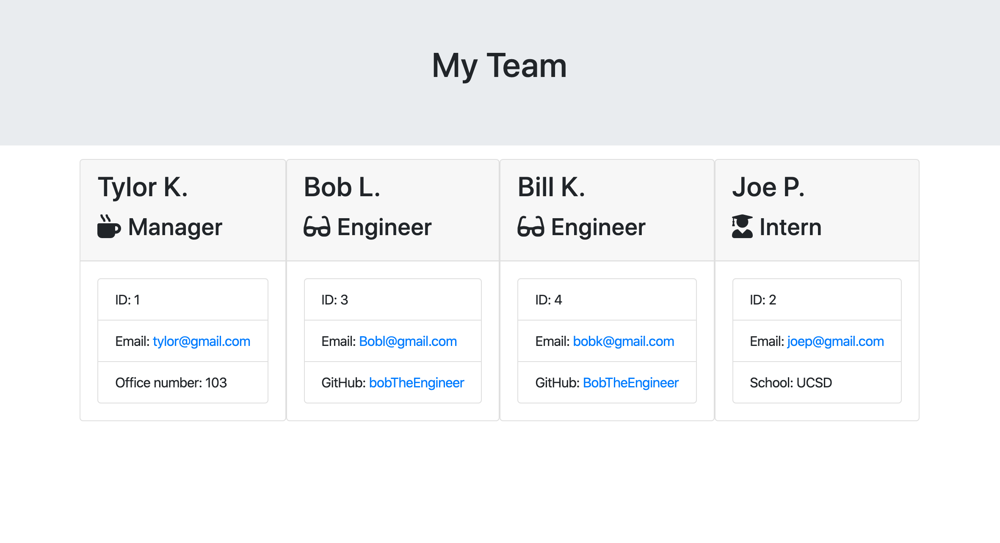

# CLI Team Generator

A CLI tool used to gather information about a team through a series of prompts. The app then uses the information to build an interface in HTML to view your team members.



## Getting Started

```cli
npm start
```

### Installing

A step by step series of examples that tell you how to get a development env running

```cli
npm i
```

End with an example of getting some data out of the system or using it for a little demo

## Running the tests

A jest test suit is integrated. To run.

```
npm test
```

## Built With

- [Inquirer](https://www.npmjs.com/package/inquirer) - Inquirer, package for creating CLI tools
- [Jest](https://jestjs.io/) - Jest is a delightful JavaScript Testing Framework with a focus on simplicity.

## Authors

- **Tylor Kolbeck**

## License

This project is licensed under the MIT License - see the [LICENSE.md](LICENSE.md) file for details

## Demo


